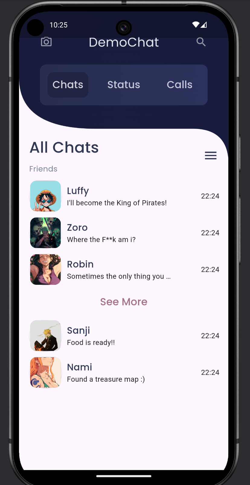
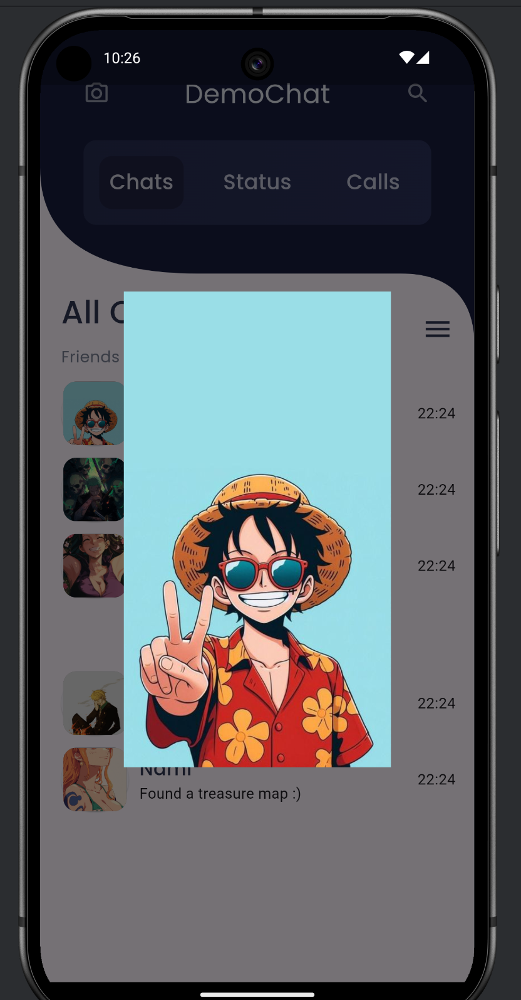

Here’s the corrected and properly formatted `README.md` file with improved structure and formatting:


# 📱 Flutter Chat App UI  

A simple chat application frontend built with **Flutter**. This project includes a single-page UI showcasing a chat screen.  

---

## 📸 Screenshots  

<p align="center">
  
  
</p>

---

## 🚀 Getting Started  

### Prerequisites  

- Install [Flutter SDK](https://flutter.dev/docs/get-started/install)  
- Setup an IDE (Android Studio / VS Code)  

### Installation  

1. **Clone the repository:**  
   ```bash
   git clone https://github.com/VickyDev810/DemoChat.git
   ```

2. **Install dependencies:**  
   ```bash
   flutter pub get
   ```

3. **Run the app:**  
   ```bash
   flutter run
   ```

---

## 📂 Project Structure  

```
lib/
│── main.dart         # Main entry point
│── home_page.dart    # UI screen for chat
│── components/       # Reusable UI components
│── utils/            # Custom clippers, colors, and utilities
```

---

## 📜 License  

This project is licensed under the **MIT License**.  

---

👨‍💻 Developed with ❤️ by **VEER VIKRAM SINGH**  

---

